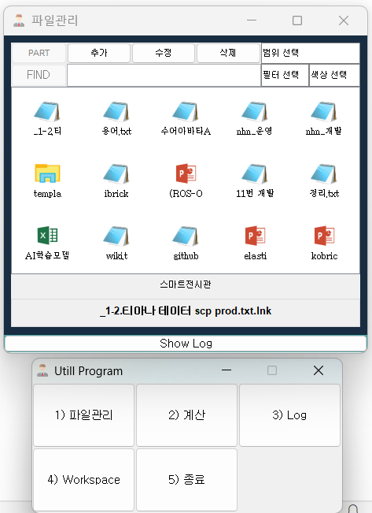

**/Util.zip 파일 다운로드 사용**

위 프로그램은 업무 향상을 위해 만든 개인 프로젝트로 

주로 파일관리를 위해 만들었습니다.

파일관리는 태그와 todo 관리의 목적이며 수시로 업데이트, 추가 

되는 파일로인해 관리가 어려워 만들었습니다.

다양한 단축키가 있으며 키보드제어만으로 파일에 접근합니다.

단축키

global system hot key : 

alt + 0~6 : 서비스 바로가기 ( 3번 Log 서비스 단축키 제외 )

alt + ` : 카카오톡 실행, 열기

ctrl + 위, 아래 : 프로젝트 선택

alt + 좌,우,위,아래 : 파일 선택

alt + q, w : 파일 체크리스트 색상 변경 ( 이전, 다음 )

alt + e, r : 체크리스트 검색 색상 변경

alt + a : 파일상세

alt + s : 파일 태그 편집

alt + d : 날짜 검색 ( 범위검색 가능 > 2개 선택 )

복잡한 디렉터리 구조를 갖는 프로젝트에 용이하며, 빠른 파일 접근과 todo 리스트 관리에 사용합니다.

파일업로드시 해당 파일의 복사가 아닌 바로가기 파일이 생성되어 원본 파일 위치 및 이름변경시에도 이상없습니다. 파일이 아닌 디렉토리 업로드도 가능하며 업로드되는 디렉터리의 바로가기 파일이 생성됩니다. windows 에 사용하기 적합하며, JAVA 기반의 프로젝트로 JVM 이 요구 됩니다. 

파일 관리 외 업무에 도움이 되는 기능을 다양하게 기획하고 있으며 업데이트일정은 미정입니다.

